# 🛒 نظام نقاط البيع (Point of Sale - POS)

نظام متكامل لإدارة عمليات البيع بالتجزئة، المخزون، والمحاسبة اليومية، مع إمكانية التحكم في صلاحيات المستخدمين، بالإضافة إلى تقارير شاملة لقياس المبيعات والأداء.

---

## 📋 القائمة الرئيسية (لوحة التحكم)

### 💰 المبيعات

-   شاشة نقطة البيع (POS)
-   **إنشاء فاتورة عبر مسح الباركود (كاميرا الموبايل)** 📸
-   إدارة الفواتير
-   إدارة مرتجعات البيع
-   عرض أسعار

### 📦 المخزون

-   المنتجات
-   الأصناف/التصنيفات
-   الموردين
-   إدارة المخزون (جرد وتحويل)
-   الوحدات

### 🧑‍🤝‍🧑 العملاء

-   إدارة العملاء
-   نقاط ولاء العملاء
-   المستخدمون (البائعون/الكاشير)

### 📊 التقارير

-   تقارير المبيعات (اليومية/الفترة)
-   تقارير الأرباح والخسائر
-   تقارير المخزون (نقص/زائد)
-   تقارير المستخدمين (أداء البائع)

### ⚙️ الإعدادات

-   إدارة الأدوار والصلاحيات
-   الإعدادات العامة للنظام
-   إدارة الفروع/المستودعات

---

## 🚀 مميزات النظام

-   واجهة بيع سريعة وسهلة الاستخدام (POS) تدعم شاشات اللمس والماسحات الضوئية.
-   **إمكانية إنشاء فواتير سريعة باستخدام كاميرا الموبايل**: تفعيل خاصية الماسح الضوئي (Barcode Scanner) عبر الكاميرا لإضافة المنتجات فورياً إلى الفاتورة، مما يسهل عملية البيع والجرد السريع.
-   إدارة شاملة للمنتجات والأصناف مع تتبع أرقام الدفعات وتواريخ الانتهاء.
-   نظام إدارة مخزون دقيق يشمل الجرد الفعلي، تنبيهات حد الطلب، وتحويل المخزون بين الفروع.
-   إنشاء وعرض تقارير مالية وتحليلية مفصلة عن حركة المبيعات وصافي الربح.
-   نظام نقاط ولاء متكامل لتعزيز علاقة المتجر بالعملاء.
-   نظام أدوار وصلاحيات مرن للتحكم في وصول الكاشير والبائعين والمحاسبين.
-   دعم طباعة فواتير صغيرة (إيصالات) وفواتير ضريبية.

---

## 🖼️ صور من النظام

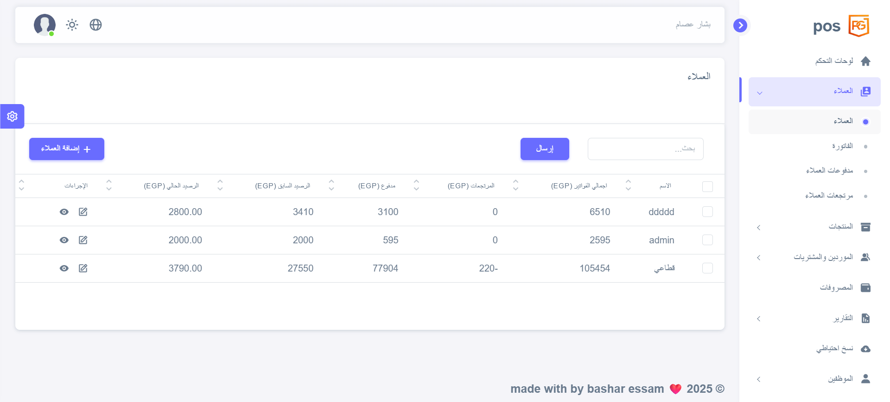
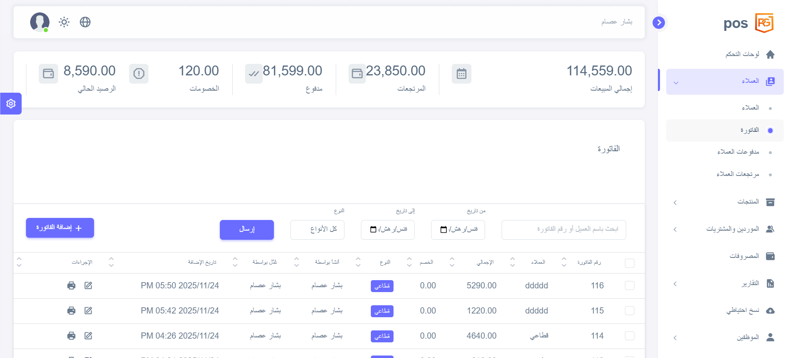
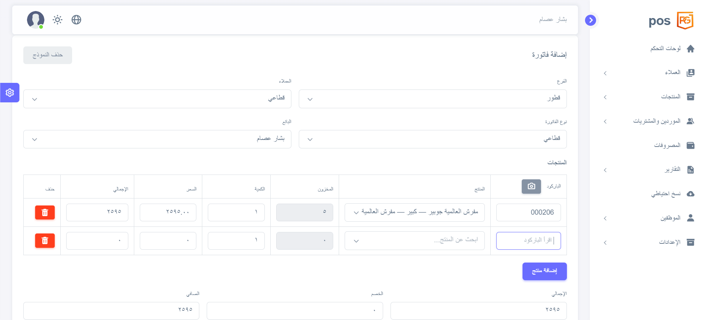
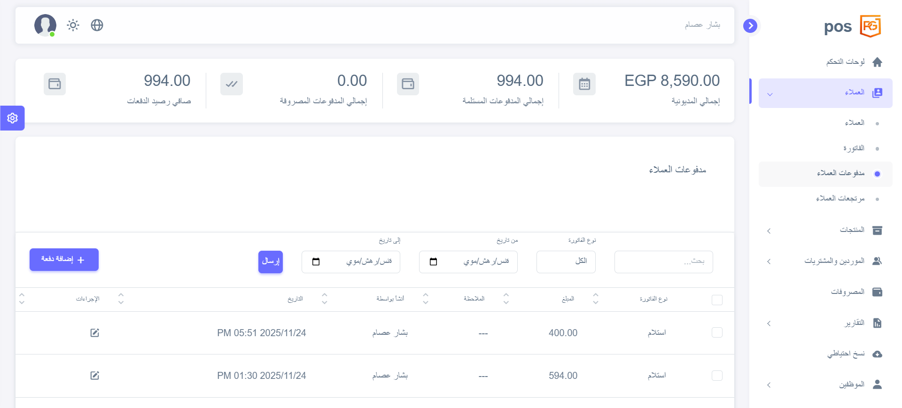
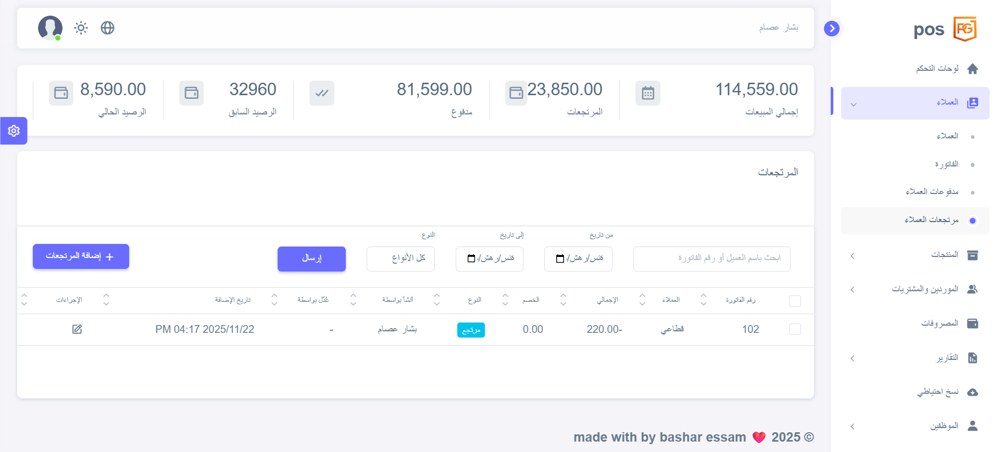
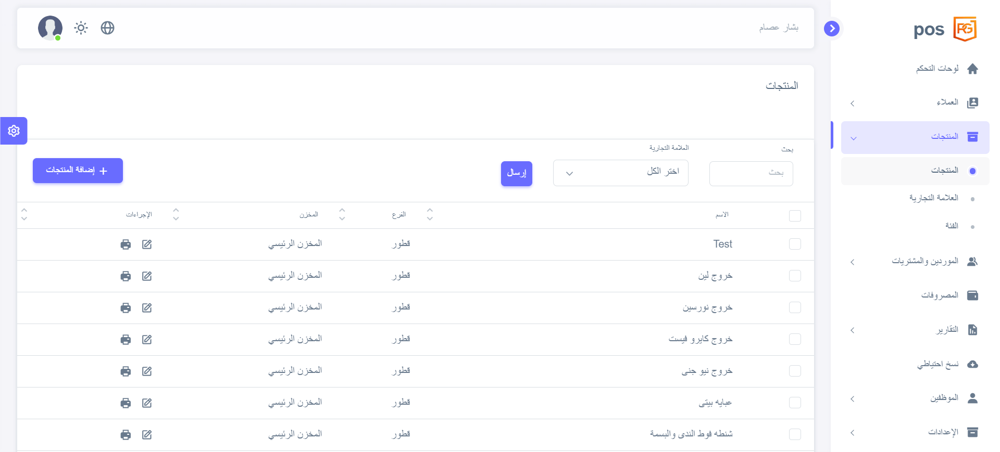
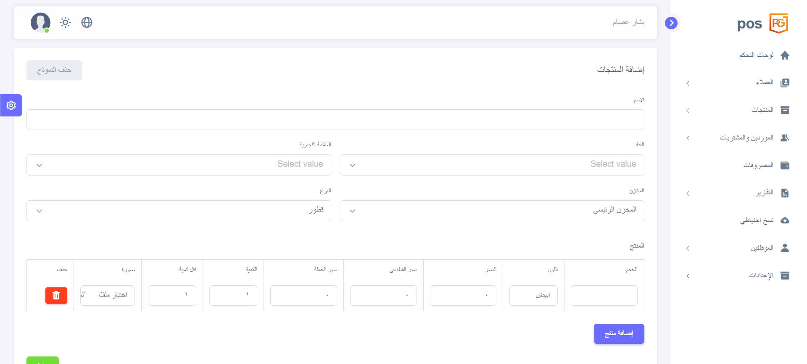
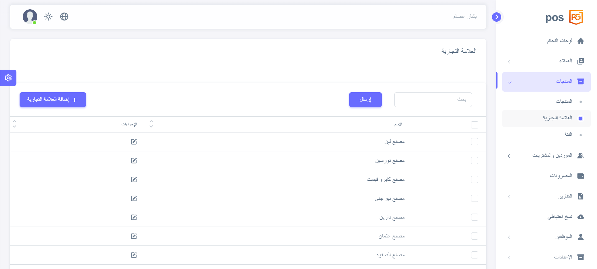
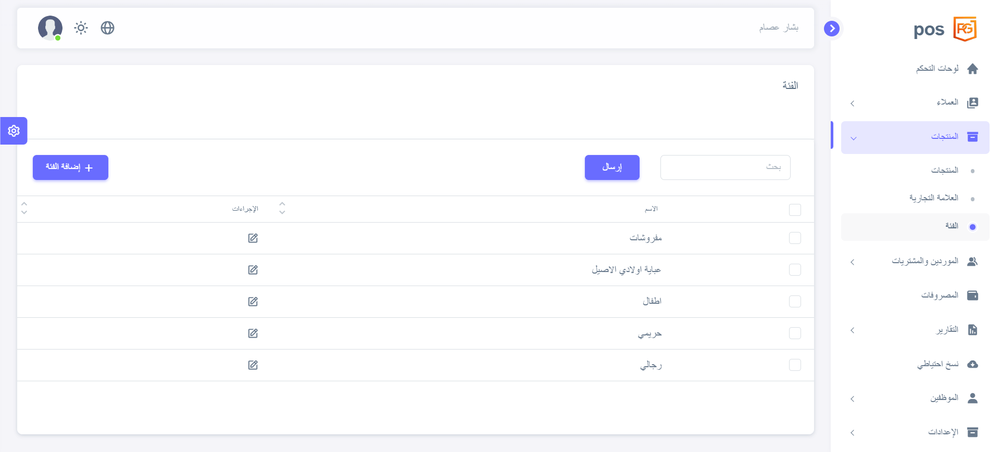
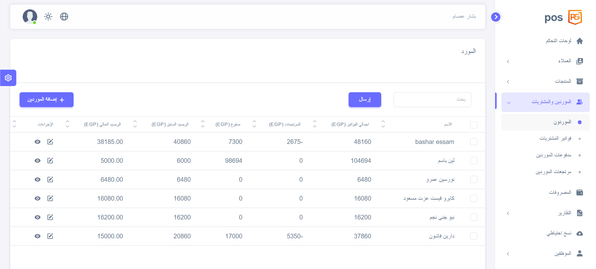
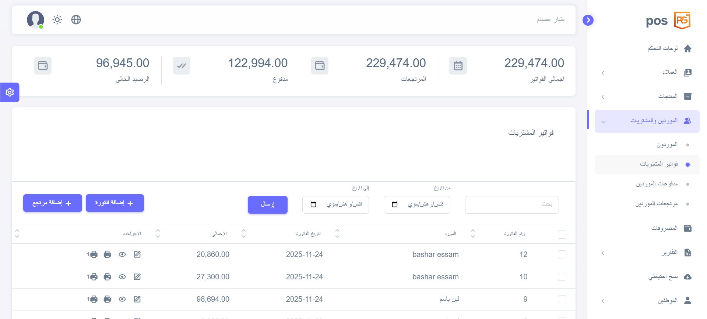
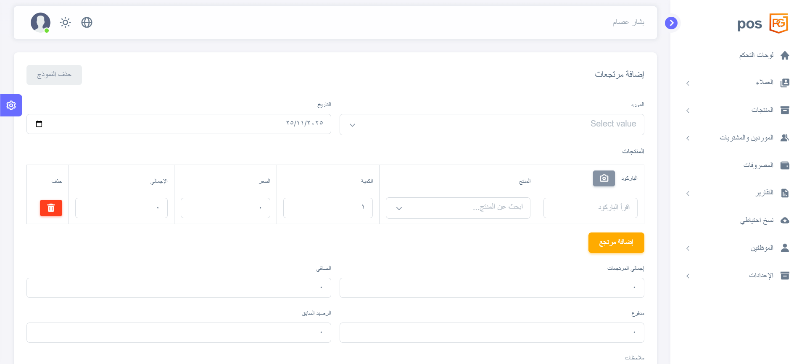
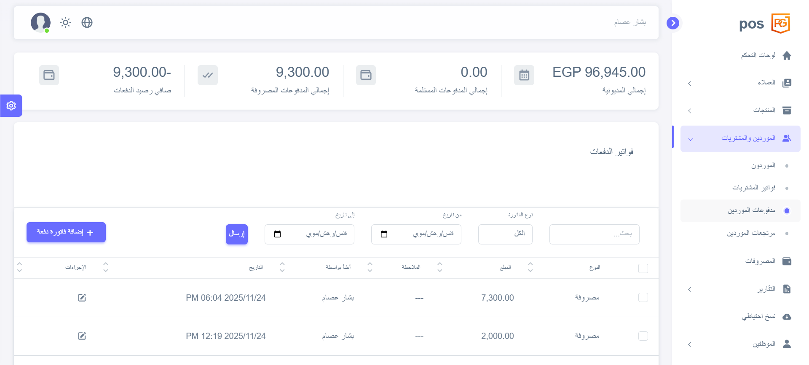
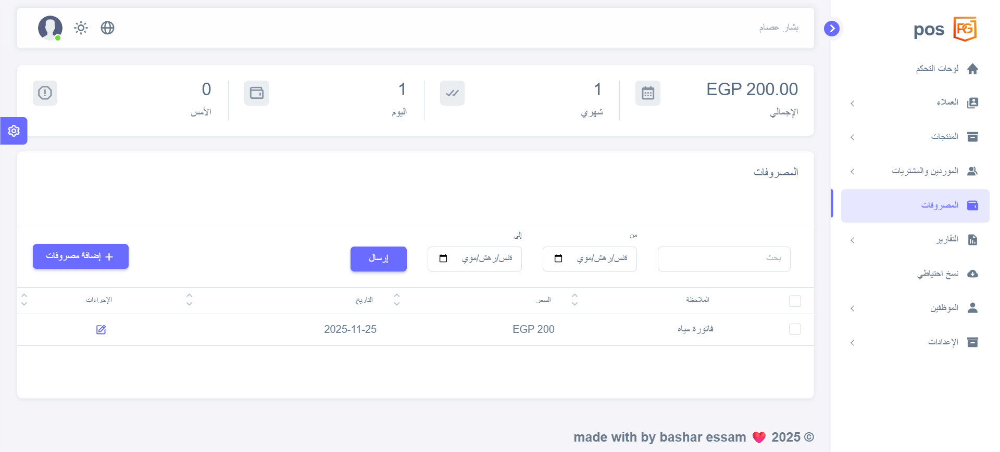
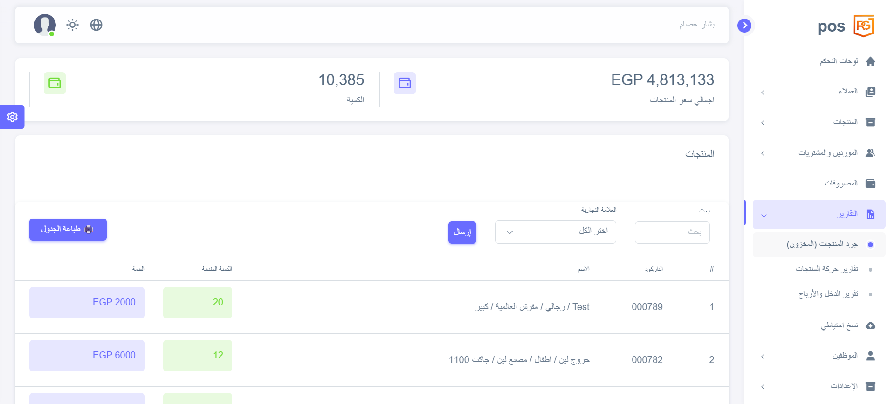
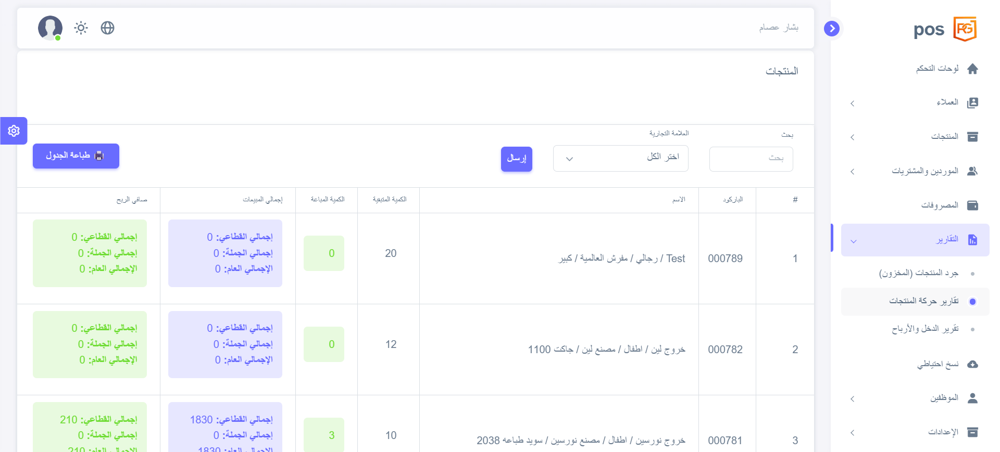
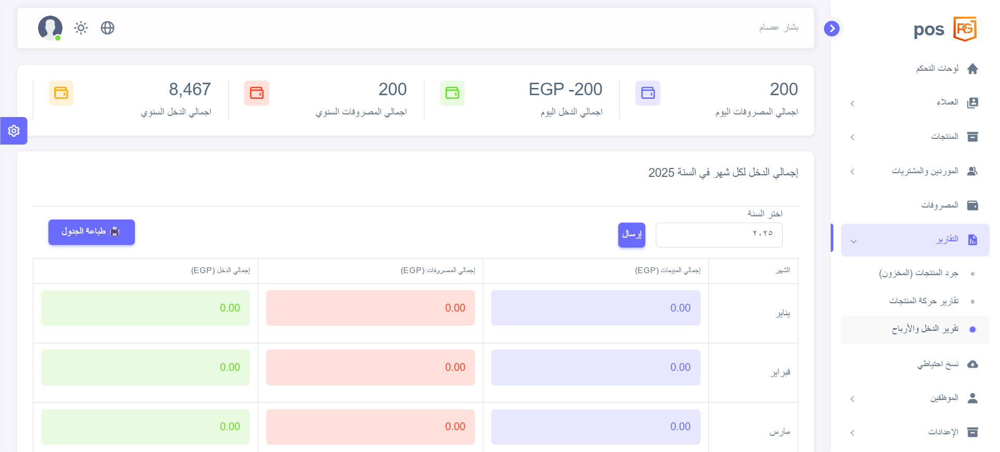
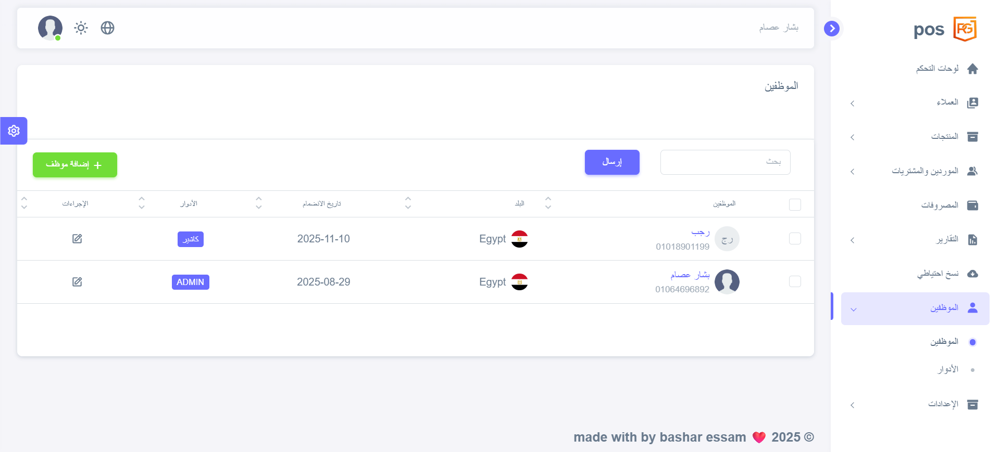
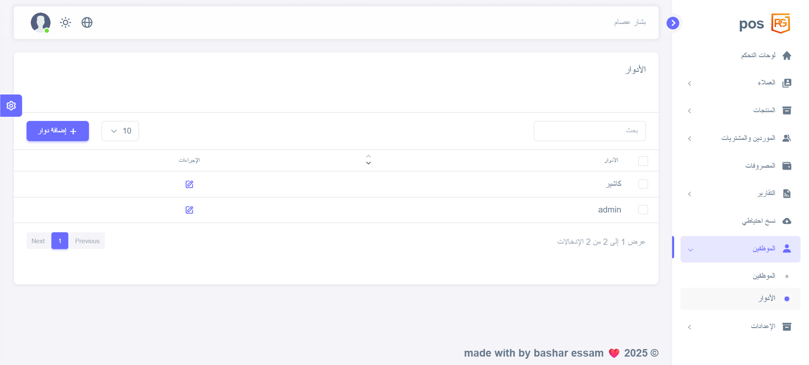
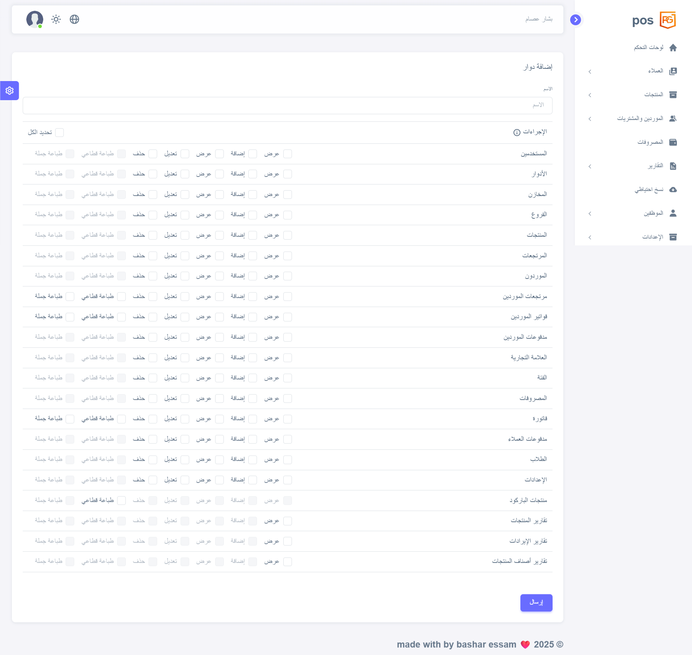
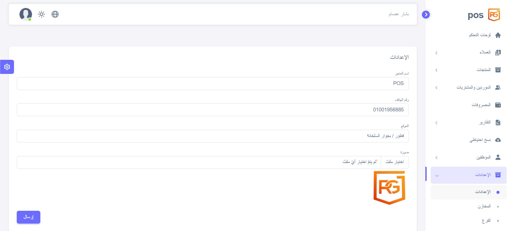
